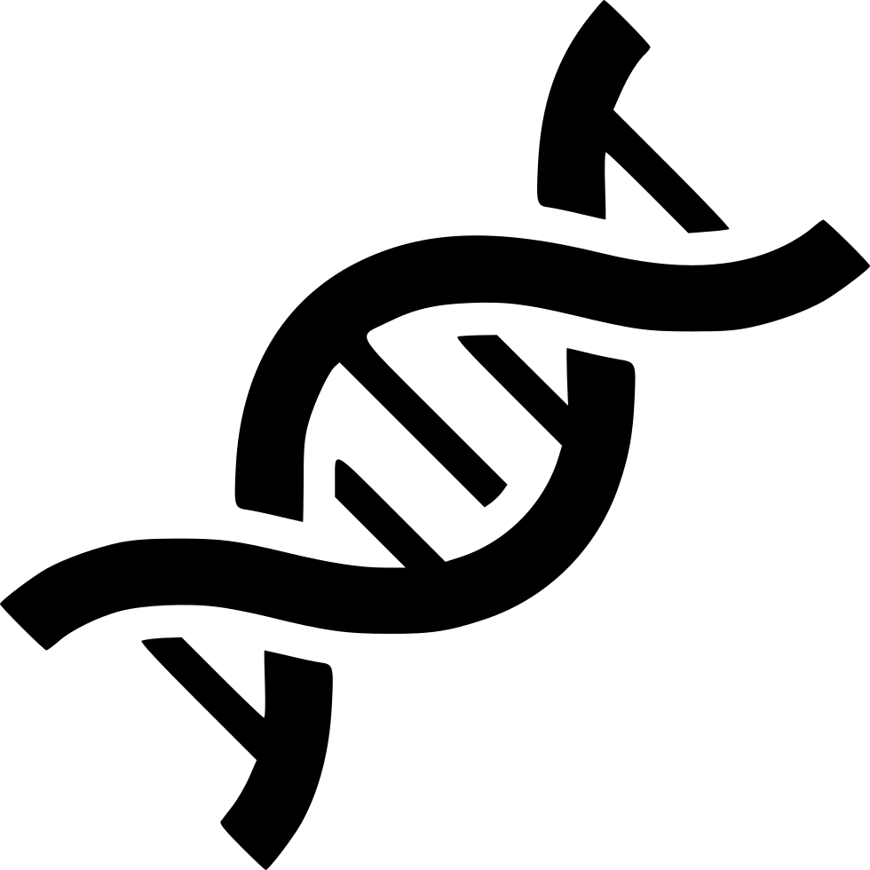

I'm a system engineer and researcher with physics, synthetic biology and embedded systems background. I've been researching many fields over the years, specially embedded systems, industrial network, communication protocols, artificial inteligence and many subfields of biology, specially CRISPR gene editing and bioinformatics.

I blog <a href="blog/">here</a> to reflect on academia, research, security, and myself. I post a lot of pictures of my everyday life, my trips, conferencies, my passions and random things on <a href="https://www.instagram.com/paolocmo/">Instagram</a>. I'm also on <a href="http://twitter.com/paoloo">Twitter</a>, <a href="https://www.researchgate.net/profile/Paolo_Oliveira">Researchgate</a>, <a href="https://scholar.google.com.ar/citations?user=gaUnn5oAAAAJ&hl=en">Google Scholar</a>, <a href="https://orcid.org/0000-0003-4117-953X">ORCID</a>, <a href="https://www.scopus.com/authid/detail.uri?authorId=56963272200">Scopus</a>, <a href="https://publons.com/researcher/2375121/j-paolo-c-m-oliveira/">Publons</a>, <a href="https://keybase.io/paolooliveira/">Keybase</a> and all my public codes may be found here on <a href="https://github.com/paoloo">Github</a>.
